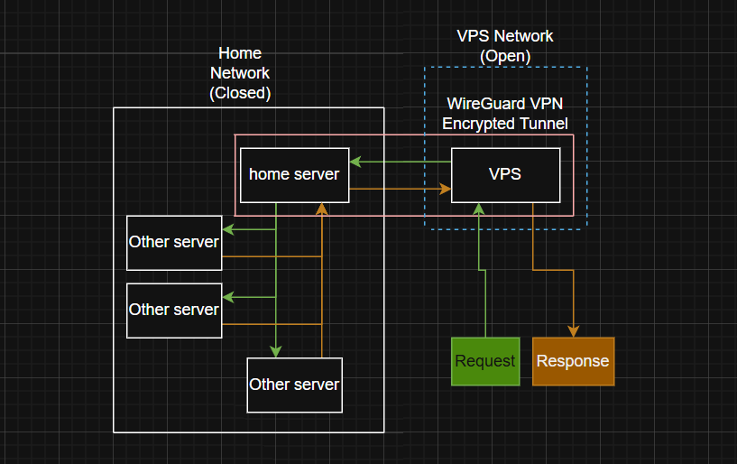
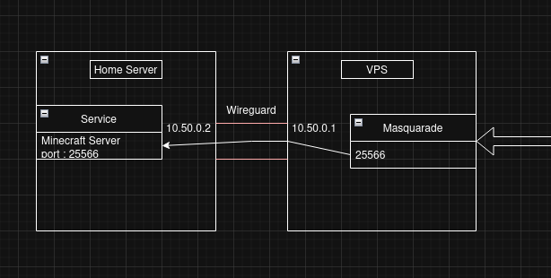
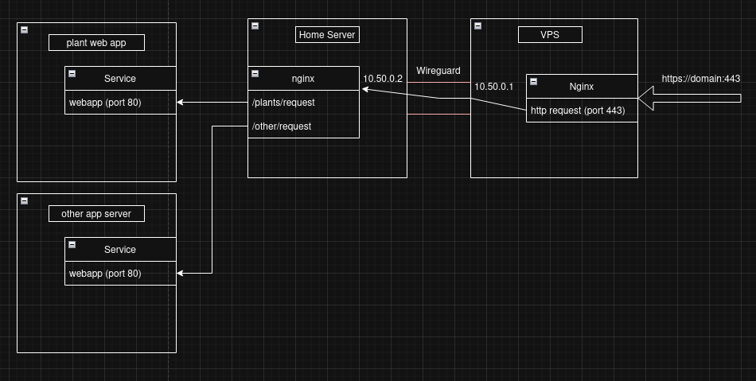

# CGNAT go-around

There are multiple ways to go around a CGNAT, one of the options that give the most control is using a vpn tunnel from a VPS, masquarade requests received from the public VPS to the cgnat restricted connected peers (your home servers).

Getting a VPS usually isnt free, but there is a way to get a free one (with limited specs) with Oracle cloud always free plan
<a href="https://www.oracle.com/ca-en/cloud/free/"> Link </a>
.

To go around CGNAT the goal is simply to create a VPN tunnel (WireGuard) between your home server and your VPS since the vps has a public reachable ip we will simply use it as our listen and create targeted masquarade rule to transfer request from the vps to your home server.



Here are some config example for WireGuard vpn Tunnel (For installation and key generation tutorial for wireguard, search the internet)

##### Your Home server config

```config
[interface]
address = 10.50.0.2/24
privatekey = [your home server private key]
mtu = 1420

[peer]
publickey = [your vps public key]
endpoint = [your vps IP]:51820
allowedips = 10.50.0.0/24
persistentkeepalive = 25
```

##### Your VPS config

```config
[interface]
Address = 10.50.0.1/24
ListenPort = 51820
PrivateKey = [your vps private key]
MTU = 1420

PostUp = iptables -A FORWARD -i wg0 -j ACCEPT;
PostDown = iptables -D FORWARD -i wg0 -j ACCEPT;

PostUp = iptables -t nat -A PREROUTING -p tcp --dport 25566 -j DNAT --to-destination 10.50.0.2:25566
PostUp = iptables -t nat -A POSTROUTING -d 10.50.0.2 -p tcp --dport 25566 -j MASQUERADE
PostDown = iptables -t nat -D PREROUTING -p tcp --dport 25566 -j DNAT --to-destination 10.50.0.2:25566
PostDown = iptables -t nat -D POSTROUTING -d 10.50.0.2 -p tcp --dport 25566 -j MASQUERADE

[Peer]
PublicKey = [your home server public key]
AllowedIPs = 10.50.0.2/32
```

While the rest of the config ensure the connection between your vps and home server, this section ensure that your VPS listen for a port and transfer the connection directly to your home server thru its peer ip (10.50.0.2)

```config
PostUp = iptables -t nat -A PREROUTING -p tcp --dport 25566 -j DNAT --to-destination 10.50.0.2:25566
PostUp = iptables -t nat -A POSTROUTING -d 10.50.0.2 -p tcp --dport 25566 -j MASQUERADE
PostDown = iptables -t nat -D PREROUTING -p tcp --dport 25566 -j DNAT --to-destination 10.50.0.2:25566
PostDown = iptables -t nat -D POSTROUTING -d 10.50.0.2 -p tcp --dport 25566 -j MASQUERADE
```

For example here : the VPS listen for port 25566 when it receive a connection it masquarade it to the peer ip (your home server) at port 25566.

This configuration need to be added for each port that you need to open to the public.



For any Web integration thru port 443 you will rapidly hit the limit that you can only host 1 website with this method, but there are ways to go around this.

First for any web integration nginx is a must have. From nginx you can set up a server that forward http request directly to your home server via the wireguard tunnel.

##### VPS NGINX CONFIG

```config
server {
    listen 80;
    server_name [your domain];
    return 301 https://$host$request_uri;
}

server {
    listen 0.0.0.0:443 ssl http2;
    server_name [your domain];

    ssl_certificate [your certificate]
    ssl_certificate_key [your key]

    ssl_protocols TLSv1.2 TLSv1.3;
    ssl_ciphers HIGH:!aNULL:!MD5;
    ssl_session_cache shared:SSL:10m;
    ssl_session_timeout 1h;

    location / {
        proxy_pass http://10.50.0.2:80;
        proxy_set_header Host $host;
        proxy_set_header X-Real-IP $remote_addr;
        proxy_set_header X-Forwarded-For $proxy_add_x_forwarded_for;
        proxy_set_header X-Forwarded-Proto $scheme;

        proxy_connect_timeout 5s;
        proxy_read_timeout 60s;
    }
}
```

On your home server you can then forward the request using routing of your choice

This example forward all the web traffic of domain:443/plants to your web app location

##### HOME SERVER NGINX CONFIG

```config
server {
    listen 80 default_server;
    server_name [your domain] 10.50.0.2;

    location = /plants {
        return 301 $scheme://$http_host/plants/;
    }
    location /plants/ {
        proxy_pass [your web app location];
        proxy_set_header Host $host;
        proxy_set_header X-Real-IP $remote_addr;
        proxy_set_header X-Forwarded-For $proxy_add_x_forwarded_for;
        proxy_set_header X-Forwarded-Proto $scheme;
        proxy_connect_timeout 10s;
    }
}
```

It is to note that the current configuration cut the ssl protocol directly upon entry in the vps since the request passes thru an encrypted vpn it felt unnecessary to keep and simpler since i dont have to deal with ssl certification on all servers BUT this is still a practice that i wouldnt recommend since it goes against the zero trust rule, potentially exposing your traffic to an intruder on your VPS.

It is also to note that this config assume that you have a server in the middle handling the tunnel connection and the forwarding to a second server (a raspberry pi for example) holding a web app following this schema



Conclusion

There are a lot of ways to achieve this kind of architecture, for example if you have multiple servers, you dont need to use a server as the middle man to handle the tunnel, you could create a peer for each server and forward traffic to each peer using the same technique used in the middleman, but in your VPS nginx config directly.

